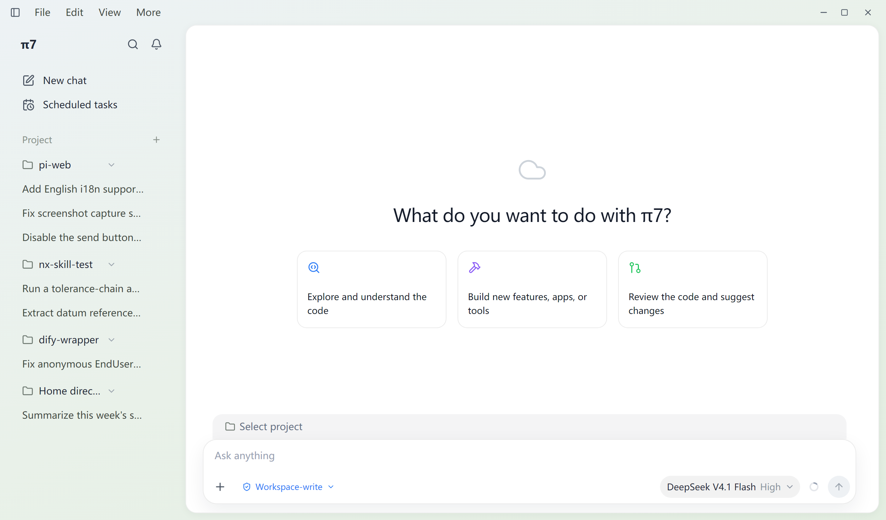

# pi web

Local single-user desktop UI for pi on Windows 7. Chinese and English UI, following the OS locale.



## Releases

Pushing a `pi7-v*` tag runs `.github/workflows/pi-web-release.yml`: three runners
(Windows, macOS, Linux) each build the pi packages, assemble the bundled runtime
via `scripts/build-runtime.mjs`, package with electron-builder, and upload the
installers to the GitHub release. Windows bundles Node 16 for Windows 7 support;
macOS and Linux bundle Node 22 and run the standard `cli.js` entry. Packages are
unsigned — Windows SmartScreen and macOS Gatekeeper will warn on first launch.

## Architecture

```text
Electron 22.3.27 (Chromium 108, Node 16.17.1)
  renderer: React 18 + Vite 6
  preload: contextBridge -> window.pi
  main process: Node 16 bridge
    -> spawn bundled Node 16.20.2
    -> pi-win7 --mode rpc
    -> JSONL over stdin/stdout
```

The renderer never talks to the pi process directly. Electron IPC carries JSON-RPC
commands and pi events. This keeps the bridge small and avoids a local WebSocket
server.

## Runtime constraints

- Target OS: Windows 7 SP1 x64.
- Electron: 22.3.27. Electron 23 and newer dropped Windows 7.
- Electron runtime: Node 16.17.1, Chromium 108.
- Frontend build: Node 18.20.x.
- pi runtime: the `pi-win7` fork, executed with bundled Node 16.20.2.

Chromium 108 limits renderer CSS and JavaScript features. Do not use `oklch()`,
`color-mix()`, CSS nesting, subgrid, view transitions, `toSorted`,
`Object.groupBy`, or `Promise.withResolvers`.

## Conversation flow

The transcript is modeled on the dsh web client's compact conversation flow: work reads as
compact rows and only the answer is prose.

```text
[user bubble]
[fold row]   29 次工具调用 · 4 条消息          <- settled turn, click to expand
[answer markdown]
```

- **Row**: 24px `icon · title · summary`. Title is the tool in Chinese (`读取`, `编辑`,
  `写入`, `Bash`, `Grep`, `Glob`, `网页搜索`, `网页获取`, `更新任务清单`, `工具调用`),
  summary is the call's salient argument (path relativized to the session cwd, or the command's
  first line), and a file mutation appends the mono `+N -M` totals. Hovering swaps the icon for
  a chevron; the whole line toggles the body.
- **Reasoning**: one `思考` row per block. While it streams the row shows the newest line,
  right-anchored, with a sweep glare; once settled it shows the first line.
- **State**: a running row keeps its icon and animates a glare band. A failed call replaces the
  icon with a red dot and shows the failure's first line in the error color instead of the
  argument; an interrupted one uses an amber dot. The status text is screen-reader only.
- **Body**: per tool, not raw JSON — `TerminalCard` (prompt line, mono output, exit-code pill),
  `DiffCard` (`- `/`+ ` lines with `⋯` between hunks and a `└ +N -M · K 个文件` footer),
  `ReadCard` (line-numbered window), `SearchCard`, `PathsCard`, `WebCard`, `FetchCard`,
  `TodoCard`, `SubagentCard`, and an input/output card for anything else. Diff, read, and search
  bodies fold at 8 rows (`… 其余 N 行`); terminal output scrolls at 224px.
- **Turn**: pi ends an assistant message at every tool call, so a turn spans several messages.
  `src/components/stream/turns.ts` groups them and splits the process from the answer; a settled
  turn with an answer folds (compact mode, on by default, toggled in 设置 → 高级设置), a
  streaming one never does.

`src/components/stream/presentation.ts` derives the whole row from the tool call (name,
arguments, streamed result, details) and is unit-tested without a DOM; the components above it
only render what it returns.

## Internationalization

The UI ships Chinese and English. The language follows the OS locale — Chinese for `zh*` locales,
English otherwise — and there is no in-app switch.

- Wrap every user-facing string in `t("中文原文")` from `src/i18n`. The Chinese source text is the
  key; `src/i18n/en.ts` maps it to English and `t()` falls back to the key when an entry is missing.
- Interpolation uses `{name}` placeholders: `t("无法读取 {name}", { name: file.name })`.
- The renderer detects `navigator.language`; the Electron main process calls
  `setLocale(localeFromTag(app.getLocale()))` after `app.whenReady()`.
- Tests run under `src/test-setup.ts`, which pins the locale to Chinese so assertions match the
  source strings.

## Development

Use Node 18 for install, typecheck, tests, and renderer builds.

```powershell
$env:PATH = "C:\Users\<user>\AppData\Local\nvm\v18.20.8;" + $env:PATH
cd pi-web
npm install --ignore-scripts --no-audit --no-fund
npm run typecheck
npm test
npm run build:electron
npm run build:renderer
```

Run the Electron development app:

```powershell
npm run electron:dev
```

`npm run electron:dev` starts Vite, waits for port 5173, then starts Electron.

### Reviewing the UI without a window

`scripts/ui-shot.cjs` renders the dev server in an offscreen Electron window against the stub
bridge in `scripts/ui-shot-preload.cjs`, and writes PNGs to `%TEMP%\piweb-shot`. It needs no pi
process and opens nothing on screen, so a layout change can be checked as an image:

```powershell
node_modules\electron\dist\electron.exe scripts\ui-shot.cjs project-picker
```

Scenarios: `chat` (default), `project-picker`. `SHOT_URL` points it at another server, `SHOT_DIR`
at another output folder. Add a scenario when a screen needs to be reviewed repeatedly. If
`ELECTRON_RUN_AS_NODE` is set in the environment, clear it first or `electron.exe` runs the script
as plain Node.

## Packaging

The package embeds `resources/pi-win7` as an extra resource. The packaged app
contains:

```text
resources/pi-win7/node/node.exe
resources/pi-win7/app/node_modules/@earendil-works/pi-coding-agent/dist/cli.win7.js
resources/pi-win7/config/agent/
```

The packaging filter excludes `auth.json`, sessions, logs, and other local state.
Never commit or distribute credentials.

`config/agent/npm/` ships the base plugin packages (pi-subagent, pi-todo, pi-web-access,
pi-sub2api-provider, pi-goal-x, pi-plan-extension) installed by `prepare-resources.mjs`
with npm's default hoisted layout — the same prefix `pi install npm:<pkg>` uses, so
shipped plugins are managed like user-installed ones. The matching `npm:` entries live in
`config/agent-default/settings.json`. File extensions stay under `config/agent/extensions/`.

At first run, the app resolves the agent dir in this order:

1. `PI_CODING_AGENT_DIR`, when set.
2. The portable `<app root>/data/agent` when it contains `auth.json`.
3. The user's `%USERPROFILE%\.pi\agent` when it contains `auth.json`.
4. The portable dir otherwise.

When the portable dir wins, it is seeded from the bundled `config/agent`: top-level
entries (including `npm/`) are copied only when missing, while bundled `extensions/`
entries are refreshed per launch so shipped file extensions always match the app version.

Build the unpacked app and ZIP:

```powershell
npm run package
npm run package:zip
```

## Verification

Development Electron E2E:

```powershell
$env:PI_CODING_AGENT_DIR = "D:\path\to\pi-web\.test-agent"
$env:PI_WORKSPACE_CWD = "$env:TEMP\pi-web-e2e-workspace"
$env:PI_WEB_E2E_SCRIPT = "scripts/e2e-smoke.mjs"
pwsh -NoProfile -ExecutionPolicy Bypass -File scripts\run-e2e.ps1
```

Run the complete development matrix:

```powershell
pwsh -NoProfile -ExecutionPolicy Bypass -File scripts\run-e2e-matrix.ps1
```

Replace the E2E script with one of:

- `scripts/e2e-tool-smoke.mjs`
- `scripts/e2e-ask-user-smoke.mjs`
- `scripts/e2e-panels-smoke.mjs`
- `scripts/e2e-real-todo-ask-smoke.mjs`
- `scripts/e2e-real-subagent-smoke.mjs`
- `scripts/e2e-web-search-smoke.mjs`
- `scripts/e2e-commands-smoke.mjs`
- `scripts/e2e-queue-smoke.mjs`
- `scripts/e2e-session-tools-smoke.mjs`
- `scripts/e2e-reconnect-smoke.mjs`

Packaged app E2E:

```powershell
$env:PI_WEB_E2E_SCRIPT = "scripts/e2e-smoke.mjs"
pwsh -NoProfile -ExecutionPolicy Bypass -File scripts\run-packaged-e2e.ps1
```

## Upgrade

The Electron and renderer layers depend on the RPC protocol, not on pi internals.
To upgrade pi:

1. Build and package the new `pi-win7` runtime on a modern machine.
2. **Re-apply the local runtime patch** (`patches/pi-multi-session.patch`) and re-sync the
   build with `node scripts/sync-pi-runtime.mjs`, then run
   `node scripts/pi-multi-session-smoke.mjs` (22 checks) before packaging.
   Without it the app silently loses multi-session support.
   See [pi runtime patch](docs/pi-runtime-patch.md) for the checklist.
3. Replace `resources/pi-win7/app` and `resources/pi-win7/node`.
4. Run `npm test`, `npm run typecheck`, and the E2E matrix.
5. Compare `get_commands`, `get_state`, and event payloads for protocol changes.
6. Run `npm run package` and the packaged E2E.

Do not copy local `auth.json`, sessions, logs, or workspace state into the release.

See [pi runtime patch](docs/pi-runtime-patch.md) for the multi-session patch and its upgrade
checklist, [extension compatibility](docs/extension-compatibility.md) for the supported
extension UI surface and [RPC coverage](docs/rpc-coverage.md) for the complete
command-to-UI mapping.

## MVP scope

Included:

- agent chat with streaming text, thinking, and per-tool rows and cards
- image attachments and image message rendering
- `@file` mentions with workspace file search; text files are injected using pi's
  `<file name="...">...</file>` format and images become image attachments
- `ask_user`, todo, subagent, `web_search`, and `web_fetch` extension flows
- slash commands and prompt templates from `get_commands`
- steer/follow-up queues, abort, compaction, auto compaction, auto retry
- session switch, fork, clone, tree, raw entries, rename, export HTML
- project chip above the composer with a searchable picker (the Codex pattern): it names the
  folder the chat runs in. A brand-new chat is unbound and reads 选择项目 — pi creates it in
  whatever folder its runtime already had, which is not a choice the user made — until they pick
  a folder or the chat has a transcript. Picking one starts the chat there (`open_session` with a
  cwd, so a multi-session pi keeps the other projects' sessions alive). Each project row in the
  sidebar also reveals a new-session button on hover
- direct bash execution and abort
- model/thinking selection and cycle commands
- queue mode, auto retry, and auto compaction settings
- reconnect after the pi RPC process exits
- Pi package install/remove/update UI backed by `pi install`, `pi remove`, and
  `pi update --extensions`

Not included:

- image generation
- code interpreter
- arbitrary terminal-only `ctx.ui.custom` components

Web search is implemented as a normal pi tool extension in
[`extensions/web-search.ts`](extensions/web-search.ts), not as renderer-side
network access. It uses DuckDuckGo HTML with a Bing fallback and requires no API key.
